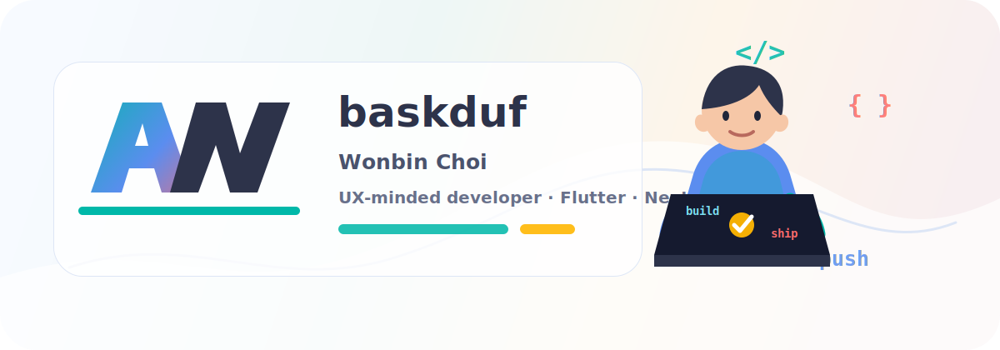
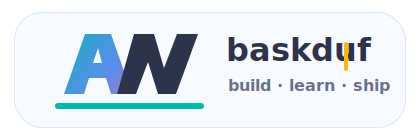

  

<h1 align="center">Wonbin Choi</h1>

  SSAFY 15th Trainee · Frontend / Mobile / Backend Learner 
  사용자의 흐름을 먼저 생각하고, 작게 검증하며, 끝까지 굴러가는 서비스를 만듭니다.

  
  
  

 

## What I Build

| Area | Focus |
| --- | --- |
| Mobile & Frontend | Flutter, Next.js, React로 빠르고 자연스러운 사용자 경험 만들기 |
| Backend | Django, Spring, Python, Java 기반으로 안정적인 서비스 흐름 설계하기 |
| Product | 작은 아이디어를 배포 가능한 형태로 만들고 실제 사용자 반응 보기 |
| Problem Solving | 알고리즘 풀이를 꾸준히 쌓으며 문제를 구조화하는 힘 기르기 |

## Tech Stack

  
  
  
  
  
  
  
  

## Featured Work

| Project | Description |
| --- | --- |
| [SSAFY-QUEST](https://ssafy-quest.vercel.app/) | 알고리즘 연습을 게임처럼 이어가게 만드는 서비스. 실사용자 130명+ 경험을 바탕으로 운영 중입니다. |
| [VitaLogue](https://vitalogue.vercel.app/) | 개인화된 건강 및 라이프 로그를 기록하는 웹 서비스입니다. |
| [운세도령](http://pf.kakao.com/_IjiZX) | 카카오톡 채널 기반의 가벼운 운세 서비스입니다. |
| 영남대학교 앱 공모전 1위 | Flutter 기반 통합 민원 포털 서비스를 개발했습니다. |

## Problem Solving

  

## Related Links

기존 README에 있던 프로젝트, solved.ac, 취향, 연락처 정보는 [RELATED_LINKS.md](./RELATED_LINKS.md)에 따로 정리했습니다.

  

